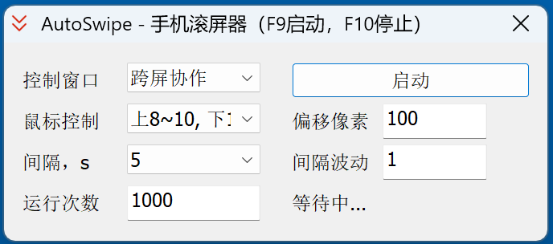

# AutoSwipe 1.0
一个MFC/C++写的薅羊毛程序，运行于Windows，通过小米笔记本的跨屏协作操作小米手机上的app，实现手机app的自动刷屏功能。

## 软件界面 (UI)

  

## 特点
支持上刷、下刷、乱刷（上刷几次，下刷一次）
可以设置刷屏时间间隔，并且可以加减随机时间，达到刷屏时间的波动效果
每次刷屏的鼠标位置可以随机变化（以屏幕像素点为单位）
可以使用快捷键（热键）启动、停止
上述参数可以保存，下次启动时自动加载

## 局限性
当前版本仅支持一个手机连接

## 开发环境及技术栈
- **集成开发环境 (IDE)：** Microsoft Visual Studio 2010 (VC2010)
- **框架：** Microsoft Foundation Classes (MFC)
- **编程语言：** C++
- **平台工具集：** v100 (对应 VS2010 的工具集)
